# Digital traces Analysis
**Small flask web application hosted on Deta and linked with Google Analytics**

# TP1
## Set up
After following Deta's tutorial to [set up a micro](https://docs.deta.sh/docs/micros/getting_started), a [Google Analytics](https://analytics.google.com/analytics/web/) account is created and linked to the deployed web application.  

## App
The app is available at [https://lhkxlc.deta.dev/](https://lhkxlc.deta.dev/)   
The home page contains some text and a link that redirect to a sub path called [click](https://lhkxlc.deta.dev/click), where there is nothing much to see.  
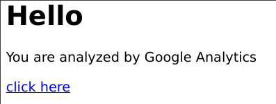

## Analytics
A few different sessions are opened to simulate various users:

| OS      | Browser | Country     |  
|---------|---------|-------------|  
| Linux   | Opera   | France      |  
| Linux   | Opera   | Indonesia   |  
| Linux   | Firefox | France      |  
| Linux   | Chrome  | France      |  
| Android | Opera   | France      |  
| Android | Opera   | Netherlands |  

Clicking, reloading pages, staying, for each session will leave digital traces that can be visualized on Google Analytic's dashboard.  
It has indeed identified distinct users, without them to connect, simply by the unicity of all their digital traces combined:  

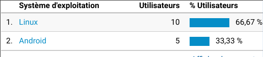
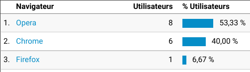
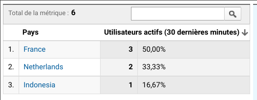

An interesting plot of real time traffic shows the number of active users, how much and when they click, and which urls are the most viewed (here the home page is loaded more times than the /click sub path).  

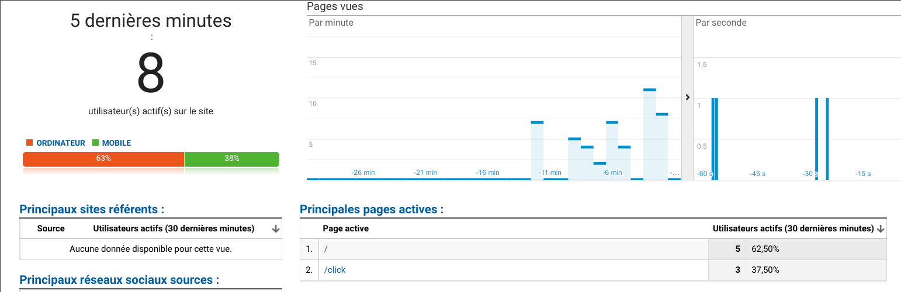

Among the various insights available, the total activity can give a good idea of the peak hours.  

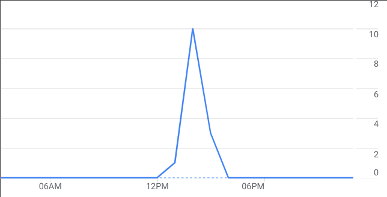

# TP2
## Logger
Another sub path is added, [logger](https://lhkxlc.deta.dev/logger). It contains a text input with a submit button and below, the user input logs, last first.  

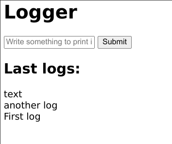  

The user input is also written in the console from a JS script, and can be viewed in the developer tools:

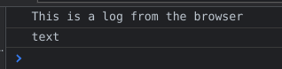  

The python code can also write logs, because it is hosted on Deta, this is visible from their 'visor' dashboard: 

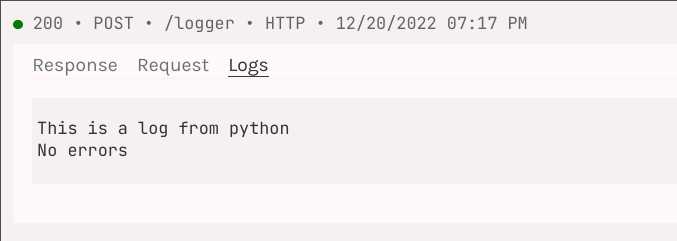  

## Cookies
The last link redirects to a Google OAuth page. Once logged in, it shows a cookie from google and the number of visitor of the website in the last 30 days. This data is obtained from the Google Analytics API.

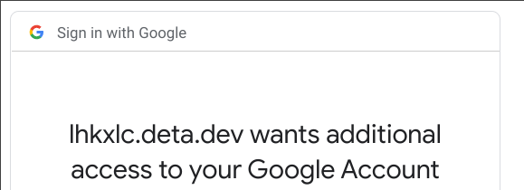  

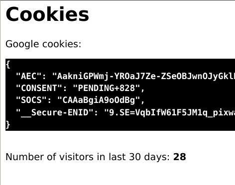  

Unfortunately, registering the cookies in a file to keep authentication is difficult because Deta is not allowing to write files.

## Environment variables
Some secret variables are needed to interact with Google Analytics. To get them, the Google Analytics API must be enabled in a Google Cloud project, and they can be downloaded. Then, they are stored in a `.env` file (not in the repository) where they can be accessed without being exposed.   

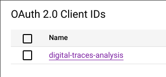  

After deploying the code with `deta deploy`, when the environment variables are changed, they have to be updated in Deta too, with `deta update -e .env`.
