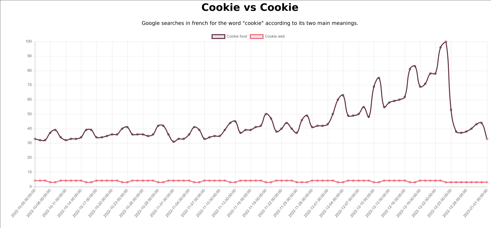
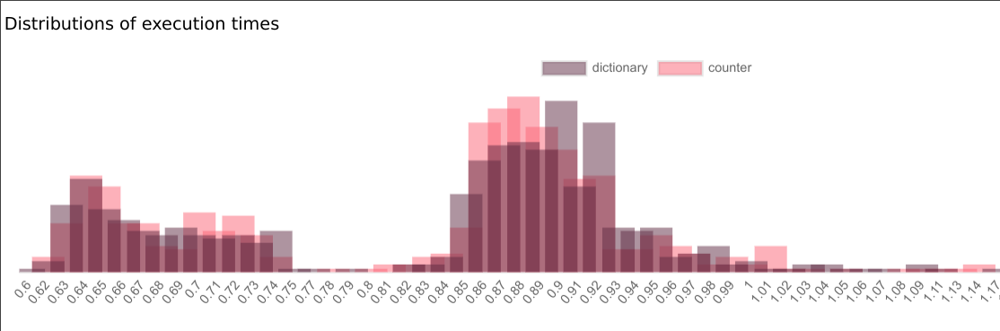
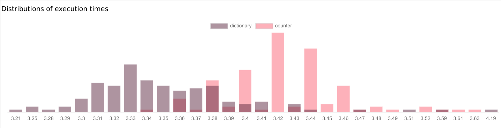

# Digital traces Analysis
**Small flask web application hosted on Deta and linked with Google Analytics**

# TP1
## Set up
After following Deta's tutorial to [set up a micro](https://docs.deta.sh/docs/micros/getting_started), a [Google Analytics](https://analytics.google.com/analytics/web/) account is created and linked to the deployed web application.  

## App
The app is available at [https://lhkxlc.deta.dev/](https://lhkxlc.deta.dev/)   
The home page contains some text and a link that redirect to a sub path called [click](https://lhkxlc.deta.dev/click), where there is nothing much to see.  

## Analytics
A few different sessions are opened to simulate various users:

| OS      | Browser | Country     |  
|---------|---------|-------------|  
| Linux   | Opera   | France      |  
| Linux   | Opera   | Indonesia   |  
| Linux   | Firefox | France      |  
| Linux   | Chrome  | France      |  
| Android | Opera   | France      |  
| Android | Opera   | Netherlands |  

Clicking, reloading pages, staying, for each session will leave digital traces that can be visualized on Google Analytic's dashboard.  
It has indeed identified distinct users, without them to connect, simply by the unicity of all their digital traces combined:  

An interesting plot of real time traffic shows the number of active users, how much and when they click, and which urls are the most viewed (here the home page is loaded more times than the /click sub path).  

Among the various insights available, the total activity can give a good idea of the peak hours.  

# TP2
## Logger
Another sub path is added, [logger](https://lhkxlc.deta.dev/logger). It contains a text input with a submit button and below, the user input logs, last first.  

  

The user input is also written in the console from a JS script, and can be viewed in the developer tools:

  

The python code can also write logs, because it is hosted on Deta, this is visible from their 'visor' dashboard: 

  

## Cookies
The last link redirects to a Google OAuth page. Once logged in, it shows a cookie from google and the number of visitor of the website in the last 30 days. This data is obtained from the Google Analytics API.

  

  

Unfortunately, registering the cookies in a file to keep authentication is difficult because Deta is not allowing to write files.

## Environment variables
Some secret variables are needed to interact with Google Analytics. To get them, the Google Analytics API must be enabled in a Google Cloud project, and they can be downloaded. Then, they are stored in a `.env` file (not in the repository) where they can be accessed without being exposed.   

  

After deploying the code with `deta deploy`, when the environment variables are changed, they have to be updated in Deta too, with `deta update -e .env`.

# TP3
## GDPR
General Data Protection Regulation (GDPR), is a european law that aims to regulate personal data uses and data privacy across all type of organisation that use this kind of sensitive data. It is applicable since May 25th, 2018. It has been put in place to avoid unethical, unfair, opaque, and possibly dangerous uses of personal data that were more and more common with the explosion of internet, in particular social medias. The former law that the GDPR replaces was called Data Protection Directive from 1995 that was outdated due to the fast evolution of internet.

## Google trend
A new endpoint is created, [`/trends`](https://lhkxlc.deta.dev/trends/), it is getting data from Google trends with pytrends and showing it with the chart.js library. The chosen trend is the searches for the word 'cookie' (in french but worldwide). The two meanings of this word (food and web cookie) are compared. A seasonal pattern can be identified, where people are more interested in the cookie food during week-ends, and at the opposite, less interested in web cookies. Also the food is way more popular than the web cookies and the searches had increased a lot with the end of the year (Christmas and new year time).  

{width=70%}  

## Timer log
To monitor the execution time of a function, a decorator is created. The function to measure is counting the occurrences of words in Shakespeare's artwork. Two approaches are made: one function using a python dictionary, and the other one using the Counter function. To have a better comparison, the timed function are executed several times, and the execution time is stored. To avoid Deta limitations on execution timeout, the functions are executed repeatedly every 10 seconds and a distribution chart is automatically updated. Also, the word counts are displayed and the execution time of the first measurement.  

{width=80%}  

It can be observed that the counter function seems generally more efficient (shorter execution time), but the difference is small. Figure 2 was computed locally, and the mean execution time is less than 0.9 seconds, but when executed on Deta, it is more over 3 seconds.  
Counter is actually a subclass of dictionary optimized to count, that can explain the better performances.  
However, on Deta, the calculations seems faster with the dictionary (Figure 3), that is difficult to explain.  

{width=80%}  
